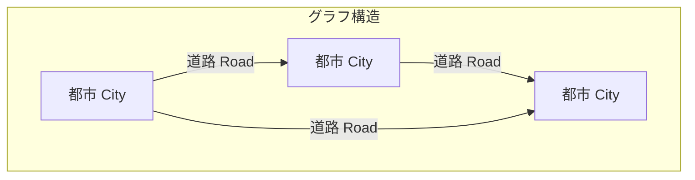
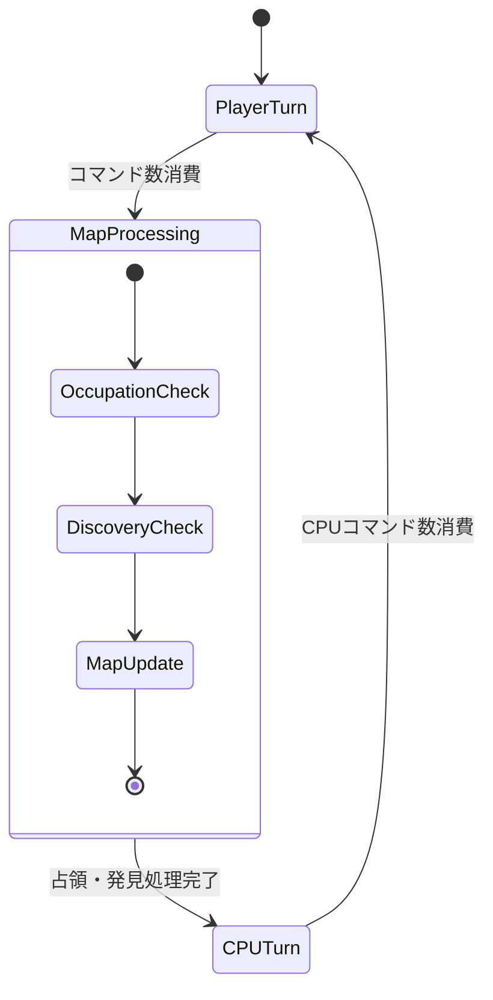
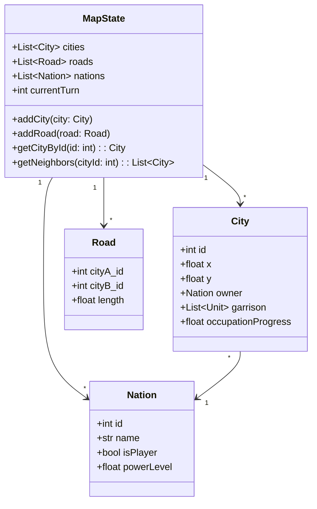

# Procedural Map Generation - Architecture Plan

# 1. ゲーム概要

本ドキュメントは、Roguelike Strategy Gameにおける**自動マップ生成システム**に焦点を当てた設計を記述する。

プレイヤーは都市と道路で構成されるグラフ型マップ上で軍ユニットを操作し、敵勢力の都市を占領していく。マップはゲーム進行に伴い動的に拡張され、新たな敵国が「発見」される形で出現する。

---

# 2. ターゲット体験（Player Fantasy）

## プレイヤーが感じたい体験

| 体験要素 | 詳細 |
|---------|------|
| **探索の興奮** | 「次に何が見つかるか分からない」未知の世界を切り開いていく感覚 |
| **戦略的判断** | 道路の接続パターンから攻めるルート・守るルートを見極める楽しさ |
| **適度な緊張感** | ターン経過で強力な敵が現れるため、拡張速度と防衛のバランスを考える |
| **達成感** | グラフが広がっていく視覚的フィードバックによる征服感 |

## 自動生成マップが果たす役割

- **リプレイ性**: 毎回異なるマップ形状がゲームに新鮮さを与える
- **難易度スケーリング**: 新都市の配置・接続数で難易度を動的に調整可能
- **ナラティブ生成**: 「発見」という形で世界が広がることで物語性を創出

---

# 3. コアメカニクス

## 3.1 マップ構造



### 都市（City / Node）
- 一意のID
- 2D座標位置（描画用）
- 所属国（Nation）
- 駐留軍ユニットリスト
- 占領進行度

### 道路（Road / Edge）
- 接続する2都市のID
- 長さ（ユークリッド距離または移動コスト）

## 3.2 マップ生成の基本原則

```
初期状態: 自軍2都市 + 敵軍1都市（正三角形配置）
      ↓
ターン経過トリガー
      ↓
新都市生成（既存グラフの外側）
      ↓
新道路生成（1〜3本、交差禁止）
      ↓
マップ更新完了
```

---

# 4. 操作体系と入力モデル

マップ生成自体はシステム自動処理であり、プレイヤー入力は発生しない。ただし、以下のUI/UXが関連する：

| 操作 | 詳細 |
|-----|------|
| マップ確認 | マウスドラッグ/ホイールでパン・ズーム |
| 新都市発見時 | カメラの自動フォーカス＋演出 |
| 都市情報表示 | マウスホバー/クリックでツールチップ |

---

# 5. ゲームループ

## マップ処理フェーズの位置づけ



## 新都市発見のトリガー条件（要調整パラメータ）

| パラメータ | 初期値案 | 説明 |
|-----------|---------|------|
| `DISCOVERY_INTERVAL_TURNS` | 3〜5ターン | 発見イベント発生間隔 |
| `DISCOVERY_PROBABILITY` | 0.3〜0.7 | 間隔経過後の発見確率 |
| `MAX_CITIES_PER_DISCOVERY` | 1〜2 | 一度に発見される都市数 |
| `ENEMY_POWER_SCALING` | 1.0 + 0.1 * turn | 新敵国の強さ係数 |

---

# 6. 状態管理・遷移

## マップ状態



---

# 7. データ設計（パラメータ化方針）

## 7.1 生成アルゴリズムパラメータ

調整頻度が高いと予想されるパラメータは外部ファイル（JSON/YAML）で管理する。

```yaml
# map_generation_config.yaml
initial_setup:
  player_cities: 2
  enemy_cities: 1
  triangle_radius: 100.0  # 初期三角形の半径

city_placement:
  min_distance_from_existing: 80.0   # 既存都市からの最小距離
  max_distance_from_existing: 200.0  # 既存都市からの最大距離
  placement_angle_variance: 30.0     # 配置角度のランダム幅（度）

road_generation:
  min_roads_per_city: 1
  max_roads_per_city: 3
  max_road_length: 150.0             # 道路長の上限
  intersection_check: true            # 交差判定を行うか

discovery:
  base_interval_turns: 4
  interval_variance: 2
  probability_per_check: 0.5
  max_new_cities: 1
  power_scaling_per_turn: 0.1
```

## 7.2 データ構造（シリアライズ対応）

```json
{
  "map": {
    "cities": [
      {"id": 0, "x": 0.0, "y": 0.0, "owner_nation_id": 0},
      {"id": 1, "x": 86.6, "y": 50.0, "owner_nation_id": 0},
      {"id": 2, "x": 43.3, "y": -75.0, "owner_nation_id": 1}
    ],
    "roads": [
      {"city_a": 0, "city_b": 1},
      {"city_a": 1, "city_b": 2},
      {"city_a": 0, "city_b": 2}
    ],
    "nations": [
      {"id": 0, "name": "Player Kingdom", "is_player": true},
      {"id": 1, "name": "Shadow Empire", "is_player": false, "power": 1.0}
    ]
  },
  "turn": 1,
  "next_discovery_turn": 5
}
```

---

# 8. バランス調整の考え方

## 8.1 難易度曲線

```
難易度
  ^
  |                    ＿＿＿＿ 
  |                 ／
  |              ／  ← 新敵国登場で急上昇
  |           ／
  |     ＿＿／     ← プレイヤー拡張期
  |   ／
  |＿＿
  +-------------------------> ターン
     初期   中盤    終盤
```

## 8.2 マップ生成が難易度に与える影響

| 要素 | 難易度↑ | 難易度↓ |
|-----|---------|---------|
| 新都市の道路数 | 1本（突出拠点） | 3本（連携しやすい） |
| 都市間距離 | 長い（移動コスト大） | 短い（素早く対応可） |
| 発見間隔 | 短い（対処が追いつかない） | 長い（準備時間確保） |
| 新敵国の初期兵力 | 高い | 低い |

## 8.3 調整方針

1. **序盤は学習期間**: 発見間隔を長くし、弱い敵から始める
2. **中盤から加速**: 発見頻度UP、敵パワースケーリング開始
3. **プレイヤーの進行度連動**: 占領都市数に応じて難易度補正

---

# 9. パフォーマンス・フレーム制約

## 9.1 処理負荷の考慮

| 処理 | 想定頻度 | 許容時間 | 備考 |
|-----|---------|---------|------|
| 道路交差判定 | 都市追加時 | 100ms以下 | O(E)の線分交差判定 |
| 配置候補探索 | 都市追加時 | 200ms以下 | 最大リトライ回数を設定 |
| グラフ描画更新 | 毎フレーム | 16ms以内 | Pyxelの60FPS維持 |

## 9.2 最適化戦略

- **空間分割**: 都市数が増えた場合にQuadtree等で近傍探索を高速化
- **遅延評価**: 交差判定は候補道路のみに実施
- **キャッシュ**: 隣接都市リストをキャッシュして毎回計算しない

---

# 10. プロトタイプ検証項目

## Phase 1: 基本生成ロジック

- [ ] 初期3都市の正三角形配置
- [ ] 新都市の外側配置ロジック
- [ ] 道路の交差判定（線分交差アルゴリズム）
- [ ] 基本的な描画確認（Pyxelでのグラフ表示）

## Phase 2: ゲームループ統合

- [ ] ターン経過による発見トリガー
- [ ] 新国家の生成と都市への割り当て
- [ ] 発見演出（カメラフォーカス）

## Phase 3: バランス調整

- [ ] パラメータファイルの読み込み
- [ ] 難易度カーブの調整
- [ ] プレイテストによる体感調整

## Phase 4: 拡張機能

- [ ] 地形・バイオーム概念の追加（将来）
- [ ] 特殊都市（資源拠点等）の生成ルール

---

# 付録: アルゴリズム詳細

## A. 新都市配置アルゴリズム

```
function generateNewCityPosition(existingCities, config):
    maxAttempts = 100
    
    for attempt in range(maxAttempts):
        # 1. 基準都市をランダム選択
        baseCity = random.choice(existingCities)
        
        # 2. グラフの「外側」方向を計算
        centroid = calculateCentroid(existingCities)
        outwardDirection = normalize(baseCity.position - centroid)
        
        # 3. 方向にランダム揺らぎを加える
        angle = random.uniform(-config.angle_variance, +config.angle_variance)
        direction = rotate(outwardDirection, angle)
        
        # 4. 距離を決定
        distance = random.uniform(config.min_distance, config.max_distance)
        
        # 5. 候補位置を計算
        candidatePos = baseCity.position + direction * distance
        
        # 6. 検証: 既存都市との最小距離
        if isValidPosition(candidatePos, existingCities, config.min_distance):
            return candidatePos
    
    # フォールバック: 制約を緩和して再試行
    return fallbackPlacement(existingCities, config)
```

## B. 道路生成アルゴリズム（交差回避）

```
function generateRoadsForNewCity(newCity, existingCities, existingRoads, config):
    roads = []
    candidates = sortByDistance(existingCities, newCity)
    
    roadCount = random.randint(config.min_roads, config.max_roads)
    
    for candidate in candidates:
        if len(roads) >= roadCount:
            break
            
        newRoad = Road(newCity, candidate)
        
        # 距離制限チェック
        if newRoad.length > config.max_road_length:
            continue
        
        # 交差チェック
        if not intersectsAnyRoad(newRoad, existingRoads + roads):
            roads.append(newRoad)
    
    # 最低1本の道路を保証
    if len(roads) == 0:
        roads.append(Road(newCity, findNearestCity(newCity, existingCities)))
    
    return roads
```

## C. 線分交差判定

```
function segmentsIntersect(seg1, seg2):
    # seg1: (A, B), seg2: (C, D)
    # CCW (Counter-Clockwise) 判定を使用
    
    def ccw(P, Q, R):
        return (Q.x - P.x) * (R.y - P.y) - (Q.y - P.y) * (R.x - P.x)
    
    A, B = seg1
    C, D = seg2
    
    # 端点を共有する場合は交差とみなさない
    if A == C or A == D or B == C or B == D:
        return False
    
    d1 = ccw(A, B, C)
    d2 = ccw(A, B, D)
    d3 = ccw(C, D, A)
    d4 = ccw(C, D, B)
    
    if ((d1 > 0 and d2 < 0) or (d1 < 0 and d2 > 0)) and \
       ((d3 > 0 and d4 < 0) or (d3 < 0 and d4 > 0)):
        return True
    
    return False
```

---

# 未決定事項・リスク

| 項目 | 内容 | 対応方針 |
|-----|------|---------|
| 都市数上限 | 無制限だと視認性・パフォーマンス問題 | 上限設定 or 自動終了条件 |
| 孤立都市 | 交差回避で道路が引けない場合 | 最短都市への強制接続をフォールバック |
| マップ形状の偏り | 一方向にだけ伸びる可能性 | 重心からの方向分散を考慮 |
| シード再現性 | デバッグ・リプレイ用 | 乱数シードの管理機構を実装 |
